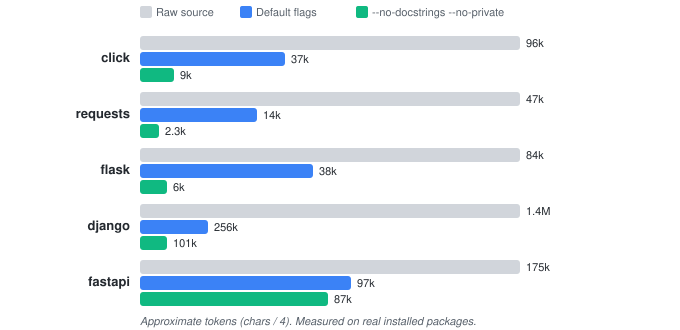

<div align="center">

# api-squash

**The API surface of any Python project, in one command.**

[](https://pypi.org/project/api-squash/)
[](https://pypi.org/project/api-squash/)
[](https://github.com/b-j-karl/api-squash/actions/workflows/ci.yml)
[](https://codecov.io/gh/b-j-karl/api-squash)
[](https://www.python.org/downloads/)
[](LICENSE)

</div>

## The Problem

AI coding assistants need to understand your codebase's structure, but pasting
full source files into a prompt wastes most of your context window on function
bodies, comments, and boilerplate the agent doesn't need.

For a package like `requests`, that's **5,600 lines of source** to convey what
**1,500 lines of signatures** could say.

api-squash parses Python source with the AST and produces compact Markdown
containing only the public API surface — classes, functions, signatures, and
type annotations — so AI agents can ingest a full project's interface in a
fraction of the tokens.

## Features

- **AST-based, not regex** — correctly handles type annotations, generics, `@overload`, decorators, nested classes
- **60–90% token savings** — measured across real packages from requests to Django
- **Zero config** — auto-excludes `__pycache__`, `.venv`, `node_modules`, `build`
- **Single dependency** — just Click; installs in seconds
- **AI-agent ready** — ships with skills for GitHub Copilot CLI and Claude Code
- **Tunable output** — `--no-docstrings`, `--no-private`, `--no-constants`, `--wrap` for full control over verbosity

## Installation

```bash
pip install api-squash
```

Or run without installing via [uvx](https://docs.astral.sh/uv/guides/tools/):

```bash
uvx api-squash --help
```

## Quick Start

Summarize a single file:

```bash
api-squash file path/to/module.py
```

Summarize an entire project:

```bash
api-squash project path/to/project/
```

### Before & After

Given a file `example_api.py`:

```python
"""Client for the Acme API."""

from dataclasses import dataclass


@dataclass
class Config:
    """Connection settings."""
    host: str
    port: int = 443
    timeout: float = 30.0


class AcmeClient:
    """High-level client for the Acme REST API."""

    def __init__(self, config: Config) -> None:
        self._config = config

    async def get_user(self, user_id: int) -> dict:
        """Fetch a single user by ID."""
        ...

    async def list_users(self, *, active: bool = True) -> list[dict]:
        """Return all users, optionally filtered."""
        ...

    def _build_url(self, path: str) -> str:
        ...
```

Running `api-squash file example_api.py` produces:

```
# example_api.py

class Config:
  Connection settings.

class AcmeClient:
  High-level client for the Acme REST API.
  def __init__(self, config: Config) -> None
  async def get_user(self, user_id: int) -> dict
    Fetch a single user by ID.
  async def list_users(self, *, active: bool = True) -> list[dict]
    Return all users, optionally filtered.
  def _build_url(self, path: str) -> str
```

With `--no-docstrings --no-private`, the output shrinks further:

```
# example_api.py

class Config:

class AcmeClient:
  def __init__(self, config: Config) -> None
  async def get_user(self, user_id: int) -> dict
  async def list_users(self, *, active: bool = True) -> list[dict]
```

## Benchmarks

<div align="center">

</div>

<!-- bench-start -->
| Package | Source files | Source lines | Output lines | Compression | ≈ Tokens |
|---|---|---|---|---|---|
| click 8.3.2 | 17 | 11,136 | 3,262 | 71% | 36,961 |
| requests 2.33.1 | 18 | 5,626 | 1,527 | 73% | 14,606 |
| flask 3.1.3 | 24 | 9,199 | 3,595 | 61% | 38,586 |
| django 6.0.4 | 899 | 161,043 | 31,308 | 81% | 279,987 |
| fastapi 0.135.3 | 48 | 19,350 | 1,977 | 90% | 97,730 |
<!-- bench-end -->

*Reproduce with `uv run python scripts/benchmark.py`.*

> **Tip — large codebases:** If the project has more than ~30 source files,
> start with `--max-depth 1 --no-docstrings` to get a high-level overview,
> then drill into specific subpackages as needed.

## Why api-squash?

| Approach | Limitation |
|---|---|
| Paste full source files | 80–90% of tokens wasted on function bodies |
| `grep -r "def "` | Misses signatures, types, class structure |
| IDE "outline" view | Not scriptable, can't feed to an LLM |
| tree-sitter queries | Requires writing custom queries per language |
| **api-squash** | **One command, full API map, token-efficient output** |

## CLI Reference

### `api-squash file`

Summarize a single Python file.

```
Usage: api-squash file [OPTIONS] PATH
```

| Option | Description |
|---|---|
| `--no-docstrings` | Strip all docstrings from the output |
| `--no-private` | Skip private classes/methods (except `__init__`); keeps items referenced by public signatures |
| `--no-constants` | Exclude module-level UPPER_CASE constants |
| `--wrap INTEGER` | Wrap long signature lines at the given column width |

### `api-squash project`

Summarize all Python files in a directory.

```
Usage: api-squash project [OPTIONS] PATH
```

| Option | Description |
|---|---|
| `--max-depth INTEGER` | Limit directory recursion depth |
| `--exclude TEXT` | Glob patterns to exclude (repeatable) |
| `--no-docstrings` | Strip all docstrings from the output |
| `--no-private` | Skip private classes/methods (except `__init__`); keeps items referenced by public signatures |
| `--no-constants` | Exclude module-level UPPER_CASE constants |
| `--wrap INTEGER` | Wrap long signature lines at the given column width |

Common directories like `__pycache__`, `.venv`, `.git`, `node_modules`,
`build`, and `dist` are skipped automatically.

## AI Agent Integration

api-squash ships with skills for **GitHub Copilot CLI** and **Claude Code**.
Clone the repo and your AI assistant automatically discovers how to use it.

The `python-code-context` skill teaches agents to run api-squash before coding
tasks — loading structural context automatically instead of reading files one
by one.

See [`docs/skills/`](docs/skills/) for skill documentation.

## Contributing

See [CONTRIBUTING.md](CONTRIBUTING.md) for the branching strategy and
development workflow.

```bash
uv sync               # install dependencies
uv run pytest -v       # run tests
uv run ruff check .    # lint
uv run ruff format .   # format
```

## License

[MIT](LICENSE)
